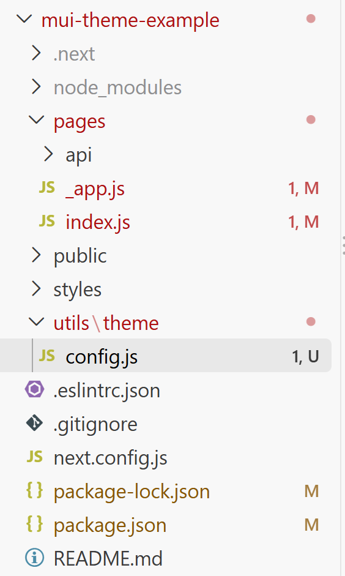

# Theme Switcher (AI Advice)

## My Prompt

I have a project with the following package.json (see also the screenshot of the current file structure). I'm looking at adding a light/dark theme switcher component. What would that component look like and where should I use it?


```json
{
  "name": "mui-theme-example",
  "version": "0.1.0",
  "private": true,
  "scripts": {
    "dev": "next dev",
    "build": "next build",
    "start": "next start",
    "lint": "next lint"
  },
  "dependencies": {
    "@emotion/react": "11.9.0",
    "@emotion/styled": "11.8.1",
    "@mui/material": "5.8.1",
    "next": "12.1.6",
    "react": "18.1.0",
    "react-dom": "18.1.0"
  },
  "devDependencies": {
    "eslint": "8.16.0",
    "eslint-config-next": "12.1.6"
  },
  "allowScripts": {
    "core-js-pure@3.22.7": true
  }
}
```



## AI Response

Yes. Given your package versions and file structure, you're using the **Next.js Pages Router**, so I would separate this into two concerns:

1. **Theme configuration/state** — put this near your existing `utils/theme/config.js`.
2. **Theme switcher UI** — make this a normal React component and place it somewhere persistent, such as an `AppBar`/header.

The important part is that the MUI `ThemeProvider` belongs in `pages/_app.js`, because that makes the selected theme apply to every page.

### 1. `utils/theme/config.js`

I would make your theme configuration capable of generating either a light or dark theme:

```js
import { createContext } from 'react';
import { createTheme } from '@mui/material/styles';

export const ColorModeContext = createContext({
  toggleColorMode: () => {},
});

export const getTheme = (mode) =>
  createTheme({
    palette: {
      mode,
    },
  });
```

You can obviously add your own palette, typography, component overrides, etc. later.

---

### 2. `pages/_app.js`

This is where I would own the light/dark state.

```jsx
import { useMemo, useState } from 'react';

import { CssBaseline } from '@mui/material';
import { ThemeProvider } from '@mui/material/styles';

import {
  ColorModeContext,
  getTheme,
} from '../utils/theme/config';

function MyApp({ Component, pageProps }) {
  const [mode, setMode] = useState('light');

  const colorMode = useMemo(
    () => ({
      toggleColorMode: () => {
        setMode((previousMode) =>
          previousMode === 'light' ? 'dark' : 'light'
        );
      },
    }),
    []
  );

  const theme = useMemo(() => getTheme(mode), [mode]);

  return (
    <ColorModeContext.Provider value={colorMode}>
      <ThemeProvider theme={theme}>
        <CssBaseline />

        <Component {...pageProps} />
      </ThemeProvider>
    </ColorModeContext.Provider>
  );
}

export default MyApp;
```

There are two providers here for different purposes:

```text
ColorModeContext.Provider
        │
        │ gives components the ability to change the mode
        ▼
ThemeProvider
        │
        │ gives MUI components the current theme
        ▼
Application
```

`CssBaseline` is also important because it causes things such as the page background to respond properly to MUI's palette mode.

---

### 3. Create a `ThemeSwitcher` component

I'd probably introduce a `components` directory:

```text
mui-theme-example/
├── components/
│   └── ThemeSwitcher.js
├── pages/
│   ├── api/
│   ├── _app.js
│   └── index.js
├── public/
├── styles/
└── utils/
    └── theme/
        └── config.js
```

Then:

```jsx
// components/ThemeSwitcher.js

import { useContext } from 'react';

import IconButton from '@mui/material/IconButton';
import { useTheme } from '@mui/material/styles';

import { ColorModeContext } from '../utils/theme/config';

export default function ThemeSwitcher() {
  const theme = useTheme();
  const colorMode = useContext(ColorModeContext);

  return (
    <IconButton
      onClick={colorMode.toggleColorMode}
      color="inherit"
      aria-label={`Switch to ${
        theme.palette.mode === 'dark' ? 'light' : 'dark'
      } mode`}
    >
      {theme.palette.mode === 'dark' ? '☀️' : '🌙'}
    </IconButton>
  );
}
```

I've deliberately used Unicode symbols there rather than `@mui/icons-material`, because your `package.json` doesn't currently include the MUI icons package.

If you wanted MUI's `Brightness4`/`Brightness7` icons, you'd need to add:

```bash
npm install @mui/icons-material@5.8.1
```

and could then use:

```jsx
import DarkModeIcon from '@mui/icons-material/DarkMode';
import LightModeIcon from '@mui/icons-material/LightMode';
```

---

## Where should you use `ThemeSwitcher`?

The **provider belongs in `_app.js`**, but the **switch itself should normally not**.

Conceptually I'd want:

```text
_app.js
└── ThemeProvider
    └── Layout
        ├── Header
        │   └── ThemeSwitcher
        └── Current Page
```

For example, eventually you might have:

```jsx
// components/Header.js

import AppBar from '@mui/material/AppBar';
import Toolbar from '@mui/material/Toolbar';
import Typography from '@mui/material/Typography';

import ThemeSwitcher from './ThemeSwitcher';

export default function Header() {
  return (
    <AppBar position="static">
      <Toolbar>
        <Typography
          variant="h6"
          component="div"
          sx={{ flexGrow: 1 }}
        >
          MUI Theme Example
        </Typography>

        <ThemeSwitcher />
      </Toolbar>
    </AppBar>
  );
}
```

and perhaps:

```jsx
// components/Layout.js

import Header from './Header';

export default function Layout({ children }) {
  return (
    <>
      <Header />
      <main>{children}</main>
    </>
  );
}
```

Then `_app.js` becomes:

```jsx
return (
  <ColorModeContext.Provider value={colorMode}>
    <ThemeProvider theme={theme}>
      <CssBaseline />

      <Layout>
        <Component {...pageProps} />
      </Layout>
    </ThemeProvider>
  </ColorModeContext.Provider>
);
```

That is the structure I'd prefer for this project.

### One refinement I would make next

The code above deliberately starts simple:

```js
const [mode, setMode] = useState('light');
```

But in a real theme switcher there are usually **three related requirements**:

- respect the user's OS/browser preference initially (`prefers-color-scheme`);
- remember an explicit choice in `localStorage`;
- avoid a light→dark flash during Next.js hydration.

Those introduce a little Next.js-specific complexity, so I wouldn't bury those details in the first implementation. The basic architecture above remains the same; we'd just improve how `_app.js` determines the initial `mode`.

In particular, with **Next 12 + MUI 5**, there's also a distinction worth making between **MUI's theme context** and the **Emotion/Next.js server-rendering setup**. Your theme switcher itself is quite small; `_app.js` is where most of the important architecture belongs.
